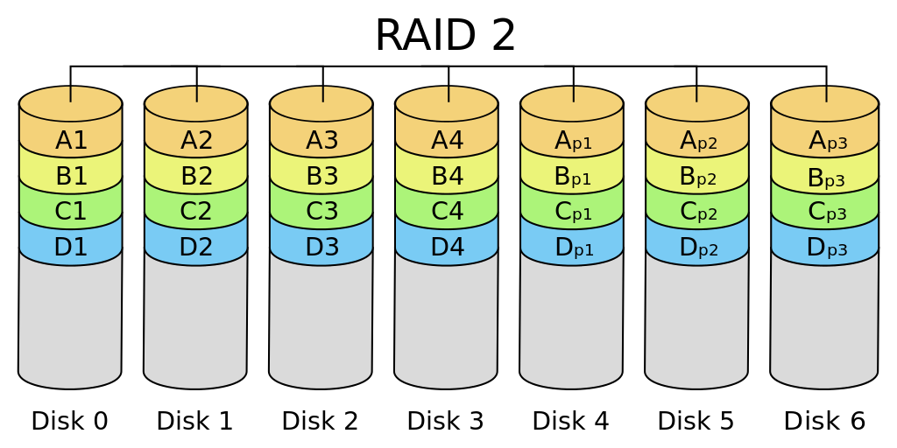
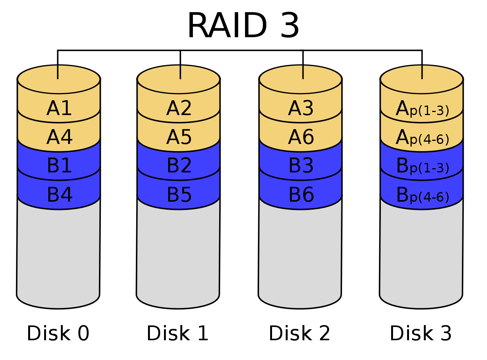
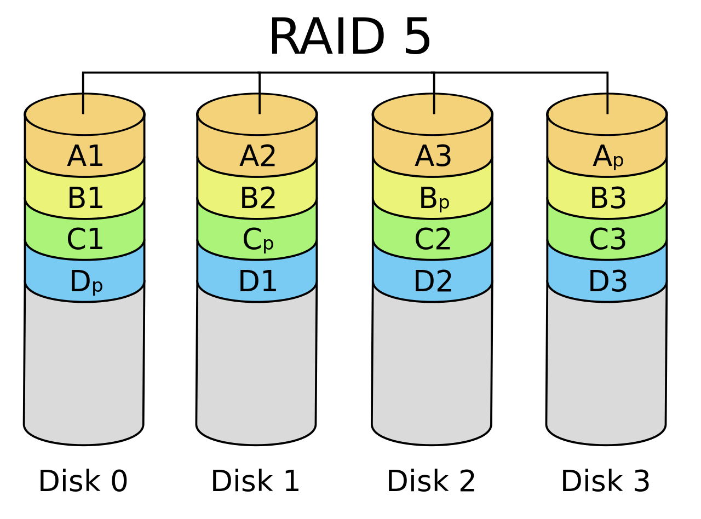

### Authentication

### Encryption

EAP type            | Client cert required| Server cert required  | WEP key management [^](https://www.intel.com/content/www/us/en/support/articles/000006999/network-and-i-o/wireless-networking.html "intel.com: \"802.1X Overview and EAP Types\"")
---                 | ---                 | ---                   | ---
[TLS][TLS]          | &#x2714;            | &#x2714;              | &#x2714;
[PEAP][PEAP]        | -                   | &#x2714;              | &#x2714;
[TTLS][TTLS]        | -                   | &#x2714;              | &#x2714;
[FAST][FAST]        | -                   | -                     | &#x2714;
[LEAP][LEAP]        | -                   | -                     | &#x2714;
[MD5][MD5]          | -                   | -                     | -

[FAST]: # 'EAP-Flexible Authentication via Secure Tunneling (EAP-FAST)&#10;Sends authentication criteria via a secure tunnel; requires a server certification to establish the tunnel but does not require a client certificate'
[LEAP]: # 'Lightweight EAP (LEAP)&#10;Proprietary EAP method that uses unencrypted challenges and responses; developed by Cisco for use on WLANs that use Cisco 802.11 wireless devices&#10;Barrett, Diane et al. _CompTIA Security+ Study Guide: Exam SY0-401_. 2015: 74'
[MD5]: # 'Message Digest series encryption algorithms (MD2, MD4, MD5)&#10;Series of hash algorithms created by Ronald Rivest, generating a hash of up to 128-bit strength out of any length of data&#10;Barrett, Diane et al. _CompTIA Security+ Study Guide: Exam SY0-401_. 2015: 456'
[PEAP]: # 'Protected EAP (PEAP)&#10;Used to protect another EAP method (like MS-CHAPv2) within a secure tunnel; co-developed by Cisco, Microsoft, and RSA Security&#10;Barrett, Diane et al. _CompTIA Security+ Study Guide: Exam SY0-401_. 2015: 73'
[TLS]: # 'Transport Layer Security (TLS)&#10;Asymmetric key encapsulation considered the successor to SSL; based on Netscape\'s SSL3 transport protocol&#10;Dulaney, Emmett. _Exam Cram: CompTIA Network+ N10-007_: 345-346,503;55'
[TTLS]: # 'Tunneled TLS (TTLS)&#10;Extension of TLS that adds tunneling and is often combined with EAP ("EAP-TLS")&#10;Dulaney, Emmett. _Exam Cram: CompTIA Network+ N10-007_: 504'

### VPN technologies
[PPP]: # 'Point to Point Protocol (PPP or PTP)&#10;===========&#10;Used for authentication by many remote access services; common networking protocol that works over telephone and includes provisions for security and protocol negotiation&#10;Dulaney, Emmett. _Exam Cram: CompTIA Network+ N10-007_: 170-171,493&#10;---&#10;Layer 2 protocol that provides authentication, encryption, and compression services to clients logging in remotely&#10;Eckert, Jason. _Linux+ Guide to Linux Certification_. Course Technology, 2012: 392&#10;---&#10;Originally defined as the protocol to use between a dial-up client and a network access server&#10;Microsoft Docs. "VPN Tunneling Protocols". https://docs.microsoft.com/en-us/previous-versions/windows/it-pro/windows-server-2008-R2-and-2008/cc771298(v=ws.10)'
[L2TP]: # 'Layer 2 Tunneling Protocol (L2TP)&#10;VPN protocol that defines its own tunneling protocol and works with the advanced security methods of IPsec; enables PPP sessions to be tunneled across an arbitrary medium to a home gateway at an ISP or corporation&#10;Dulaney, Emmett. _Exam Cram: CompTIA Network+ N10-007_: 484&#10;---&#10;Allows multiprotocol traffic to be encrypted and then sent over IP or ATM, relying on IPsec in Transport Mode&#10;Microsoft Docs. "VPN Tunneling Protocols". https://docs.microsoft.com/en-us/previous-versions/windows/it-pro/windows-server-2008-R2-and-2008/cc771298(v=ws.10)'
[SSTP]: # 'Secure Socket Tunneling Protocol (SSTP)&#10;===========&#10;Encapsulates PPP frames in IP datagrams for transmission over the network&#10;Microsoft Docs. "VPN Tunneling Protocols". https://docs.microsoft.com/en-us/previous-versions/windows/it-pro/windows-server-2008-R2-and-2008/cc771298(v=ws.10)'

VPN protocols
- [PPP][PPP]
- [L2TP][L2TP]
- [SSTP][SSTP]

IPSec
- IKE
  - X.509 PKI certificates for authentication
  - Diffie-Hellman key exchange protocol
  - 2 phases:
    1. IKE creates an authenticated, secure channel between two IKE peers using D-H key agreement protocol
    2. IKE negotiates IPSec security associations and generates required key material for IPSec
- responsible for negotiating SAs

### RAID

Description | Image
---         | ---
**RAID 0** Built with no internal redundancy, each disk provides its full capacity to the array as usable storage. Although technically single disk can work, at least two disks is more typical. | 
**RAID 1** Mirrored set of drives, which have to be the same size or space will be forfeited to accomodate the smallest drive. | 
**RAID 2**  | 
**RAID 3**  | 
**RAID 4**  |  
**RAID 5** Middle ground which stripes data across multiple drives but with some redundancy, requiring at least **3** disks. An array containing *n* drives makes *n - 1* drives' worth of storage, with one drive's worth of space being used to provide redundancy. | 
**RAID 6**  | 
**RAID 10** Multiple RAID 1 arrays are treated as drives in a RAID 0, so data is striped across mirrored arrays. | 
**RAID 50** Multiple RAID 5 arrays contained in a RAID 0, and because there are at least of such arrays involved the minimum number of drives is **6**. | 

### DNS

###### Resource records
[A record]: #dns 'A record&#10;IPv4 address record&#10;Dulaney, Emmett. _CompTIA Network+ N10-007 Exam Cram, 6th Edition_.: 71'
[AAAA record]: #dns 'AAAA record&#10;IPv6 address record&#10;Dulaney, Emmett. _CompTIA Network+ N10-007 Exam Cram, 6th Edition_.: 70'
[CNAME record]: #dns 'CNAME record&#10;"canonical name record", hostnames or aliases for hosts in the domain; gives a single computer multiple names&#10;Dulaney, Emmett. _CompTIA Network+ N10-007 Exam Cram, 6th Edition_.: 70'
[MX record]: #dns 'MX record&#10;"mail exchange record", stores information about where mail for the domain should be delivered&#10;Dulaney, Emmett. _CompTIA Network+ N10-007 Exam Cram, 6th Edition_.: 71'
[NS record]: #dns 'NS record&#10;"name server record", stores information that identifies name servers in the domain that store information for that domain&#10;Dulaney, Emmett. _CompTIA Network+ N10-007 Exam Cram, 6th Edition_.: 70'
[PTR record]: #dns 'PTR record&#10;"pointer record", records used for reverse lookup, or resolving IP addresses to hostnames&#10;Dulaney, Emmett. _CompTIA Network+ N10-007 Exam Cram, 6th Edition_.: 70'
[SOA record]: #dns 'SOA record&#10;"start of authority record", contains data on DNS zones and other records; each zone cdontains a single SOA record&#10;Dulaney, Emmett. _CompTIA Network+ N10-007 Exam Cram, 6th Edition_.: 70'
[SRV record]: #dns 'SRV record&#10;"service locator", generalized service location record, used for newer protocols instead of protocol-specific records (i.e. MX)&#10;Dulaney, Emmett. _CompTIA Network+ N10-007 Exam Cram, 6th Edition_.: 70'
[TXT record]: #dns 'TXT record&#10;"text record", originally created to carry human-readable text in a DNS record, but today more commonly holds machine-readable data&#10;Dulaney, Emmett. _CompTIA Network+ N10-007 Exam Cram, 6th Edition_.: 71'

[`A`][A record] 
[`AAAA`][AAAA record] 
[`CNAME`][CNAME record] 
[`MX`][MX record] 
[`NS`][NS record] 
[`PTR`][PTR record] 
[`SOA`][SOA record] 
[`SRV`][SRV record] 
[`TXT`][TXT record] 